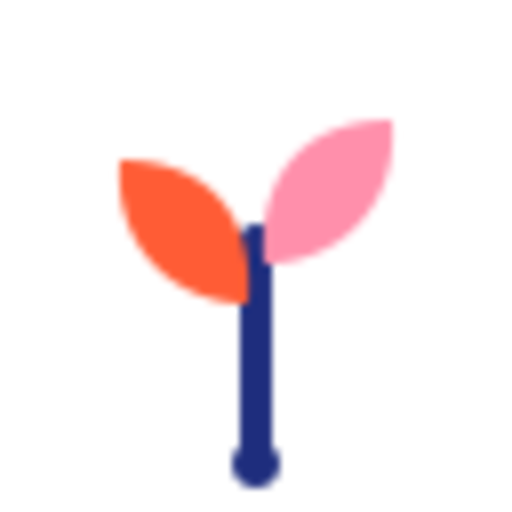

<div align="center">
  

  # Semilla

  **Plataforma educativa con IA para Telesecundarias mexicanas.**

  Quiz semanal con retroalimentación por IA para el alumno, diagnóstico de grupo
  y borradores de reporte CTE para el docente. Diseñada para bajo costo, baja
  fricción operativa y uso _offline-first_.

  <p>
    
    
    
    
    
    
  </p>
</div>

---

## 📖 Acerca del proyecto

**Semilla** (nombre interno del repo: _NEXO_) es una plataforma pensada para el
contexto de las **Telesecundarias** del sistema educativo mexicano (SEP). Atiende
dos necesidades reales que hoy consumen tiempo y no tienen herramienta digital:

- **Para el alumno** — un quiz semanal que, ante una respuesta incorrecta,
  responde con **retroalimentación cálida generada por IA** que nombra el
  malentendido y lo invita a reintentar, sin penalizar el error.
- **Para el docente** — un **diagnóstico automático del grupo** (nivel de dominio
  por tema, alertas de riesgo) y **borradores de reporte CTE** (Consejo Técnico
  Escolar) redactados en lenguaje institucional SEP, listos para revisar y firmar.

Todo el código, la interfaz y los datos están en **español**, alineados al dominio
educativo mexicano: ciclo escolar, bloques, CCT, CTE y repetición espaciada.

---

## ✨ Características

### 👩‍🎓 Alumno
- Quiz semanal con preguntas del banco curricular (materia → tema → pregunta).
- Retroalimentación pedagógica por IA en cada respuesta incorrecta.
- Vista de progreso y libros de texto de referencia.
- Asistente de chat con _streaming_ contextualizado.

### 👨‍🏫 Docente
- Tablero con diagnóstico del grupo y alertas de riesgo (sin exponer nombres).
- Selector de temas y configuración de la semana.
- Editor de reporte CTE con borrador generado por IA.
- Histórico de semanas aplicadas y firma del reporte.

### 🔐 Plataforma
- Roles: `alumno`, `docente`, `directivo`, `admin_zonal`.
- Seguridad real con **políticas RLS de PostgreSQL**; guard optimista de rol por ruta.
- Datos personales (CURP, RFC, nombres) tratados **solo en servidor**.

---

## 🧱 Stack tecnológico

| Capa | Tecnología | Detalle |
|---|---|---|
| **Framework** | Next.js 16.2.6 (App Router) | `proxy.ts` reemplaza a `middleware.ts` |
| **UI** | React 19 | |
| **Estilos** | Tailwind CSS v4 | vía `@tailwindcss/postcss`, sin config clásico |
| **Lenguaje** | TypeScript 5 | |
| **BD / Auth / Storage** | Supabase | PostgreSQL 15, Auth JWT, RLS (`@supabase/ssr`) |
| **IA** | Google Gemini `gemini-2.5-flash` | wrapper central en `lib/ai.ts` (`@google/genai`) |

---

## 🟦 Mapeo a stack Microsoft

Este proyecto se desarrolló para el **Hackathon de Microsoft**. La arquitectura es
portable 1:1 a servicios gestionados de Azure: lo que no es de Microsoft (React,
Tailwind) no se reemplaza, y lo que sí lo es (TypeScript) ya está cubierto.

| Lo que usamos | Equivalente Microsoft | Por qué es equivalente |
|---|---|---|
| Next.js 16 | **Azure Static Web Apps** | Servicio nativo para apps Next.js con SSR y despliegue directo desde GitHub |
| React 19 | React 19 | Es la misma librería — React no es de Microsoft, no se reemplaza |
| TypeScript | TypeScript | TypeScript **sí** es de Microsoft — ya está cubierto |
| Tailwind CSS | Tailwind CSS | CSS utility, agnóstico al proveedor — no se reemplaza |
| Supabase (PostgreSQL + Auth + Storage) | **Azure SQL Database** + **Microsoft Entra ID** + **Azure Blob Storage** | Tres servicios separados, equivalentes en función |
| Google Gemini | **Azure OpenAI Service (GPT-4o)** | Modelo equivalente en capacidad, gestionado por Microsoft |

### Stack ideal para Microsoft

<div align="center">

| | | |
|:---:|:---:|:---:|
| **Next.js 16** | **TypeScript** | **Azure SQL** |
| **React 19** | **Tailwind CSS** | **Azure OpenAI** |

</div>

---

## 🗂️ Estructura del proyecto

```
.
├── schema.sql                 # DDL de PostgreSQL (catálogo, institucional, operación)
└── semilla/                   # Aplicación Next.js
    ├── app/                   # App Router
    │   ├── alumno/            # quiz, progreso
    │   ├── (docente)/         # tablero, configurar, reporte, semana, histórico
    │   ├── api/               # quiz, ai, reportes, admin, me
    │   ├── login/  perfil/  acceso-denegado/
    │   ├── layout.tsx  page.tsx  globals.css
    ├── components/
    │   ├── alumno/            # NavAlumno, RetroalimentacionCard, LibrosTexto…
    │   ├── docente/           # DiagnosticoGrupo, ReporteCTEEditor, AlertaRiesgo…
    │   └── ChatAsistente.tsx
    ├── lib/
    │   ├── ai.ts              # Wrapper IA: retroalimentación + reporte CTE
    │   ├── contexto-chat.ts
    │   └── db/                # client.ts (browser) · server.ts (SSR)
    ├── types/                 # nexo.ts · semilla.ts
    └── proxy.ts               # Middleware Next 16: sesión Supabase + guard de rol
```

---

## 🗄️ Modelo de datos

Definido en [`schema.sql`](schema.sql) (PostgreSQL):

- **Catálogo curricular** — `materia` → `tema` → `pregunta` (con distractores que
  mapean cada error conceptual a una pista pedagógica).
- **Institucional** — `escuela` → `profesor` → `grupo` → `alumno`.
- **Operación semanal** — `semana` → `semana_materia` → `aplicacion` →
  `pregunta_aplicada` → `respuesta_alumno`.
- **Diagnóstico / reportes** — `diagnostico_alumno`, `reporte`.
- **Auditoría** — `audit_log`.

El diagnóstico (nivel de dominio 0–3, `requiere_repaso`) se calcula al cerrar una
aplicación y alimenta tanto el motor de repetición espaciada como los reportes CTE.

---

## 🚀 Puesta en marcha

### Requisitos
- Node.js 20+
- Un proyecto de Supabase (o Azure SQL + Entra ID en el escenario Microsoft)
- Una API key de IA (Gemini, o Azure OpenAI en el escenario Microsoft)

### Instalación

```bash
git clone https://github.com/RogelioZu/U-hacks.git
cd U-hacks/semilla
npm install
```

### Variables de entorno

Crea `semilla/.env.local`:

```bash
NEXT_PUBLIC_SUPABASE_URL=
NEXT_PUBLIC_SUPABASE_ANON_KEY=
SUPABASE_SERVICE_ROLE_KEY=     # solo servidor — nunca al cliente
AI_API_KEY=                    # https://aistudio.google.com/apikey
```

> ⚠️ Las variables `NEXT_PUBLIC_*` se exponen al navegador. La
> `SUPABASE_SERVICE_ROLE_KEY` y la `AI_API_KEY` viven **solo en el servidor**.

### Base de datos

Aplica el esquema a tu proyecto de Supabase/PostgreSQL:

```bash
psql "$DATABASE_URL" -f ../schema.sql
```

### Desarrollo

```bash
npm run dev      # servidor de desarrollo en http://localhost:3000
npm run build    # build de producción
npm run start    # servir el build
npm run lint     # eslint (eslint-config-next)
```

---

## 🤖 Estilo de la IA

El wrapper de IA vive en [`semilla/lib/ai.ts`](semilla/lib/ai.ts). El modelo es
configurable desde una constante al inicio del archivo.

- **Retroalimentación al alumno** — cálida, tutea, nunca penaliza el error; evita
  palabras como «mal» o «incorrecto», y cierra con una invitación a reintentar
  (máx. 3 oraciones).
- **Reporte CTE** — lenguaje institucional formal SEP: contexto del grupo, avances
  por competencia, áreas de oportunidad y estrategias de mejora.

---

## 🔒 Seguridad

- La autorización real son las **políticas RLS de PostgreSQL**; el guard de
  `proxy.ts` es solo UX, no seguridad.
- Toda tabla sensible (`alumno`, `respuesta_alumno`, `grupo`, `reporte`) lleva RLS.
- El dashboard docente muestra **agregados sin nombres**.
- Los datos personales se procesan únicamente en servidor con la _service role key_.

---

<div align="center">
  <sub>Hecho con 🌱 para el Hackathon de Microsoft · Educación · Telesecundarias de México</sub>
</div>
